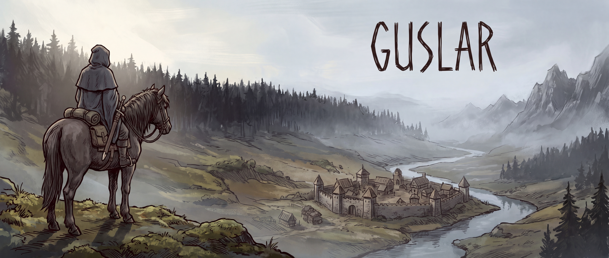

<p align="center">
  
</p>

# Guslar

**A painted Slavic dark-fantasy world map for your Claude Code sessions.**

Guslar turns the agent work you already do into a world you can look at. Your repos are regions on a hand-painted map. Every spec is a village with a bounty posted. Every slice is a contract nailed to that village's notice board. Take a contract and a hunter rides out: a real Claude Code session, running your `implement-slice` skill, whose progress you watch on the map and whose questions reach you as a red flare in the mud.

It is one player's tool, built for one player. If the terminal has stopped being fun, this is the other window.

## Why

Agents can write the code now. What is left is knowing what to build, keeping several agents on the rails at once, and trusting what comes back. That work is dull in six terminal tabs and hidden from you until something goes wrong. Guslar puts it on a map: which villages have work, which contracts are ready, which hunter needs you, which came back with a trophy.

The name is a *guślarz*, the village sorcerer who calls up spirits, and a *guslar*, the bard who sings of what the heroes did. You summon the hunters. Guslar sings it back.

## The world

| On the map | In your repos |
|---|---|
| Region | a repo you registered |
| Village | a spec in `.scratch/specs/` |
| Bounty posted | a spec with no slices yet |
| Contract on the notice board | one slice from `.scratch/slices/` |
| Sealed contract | a slice blocked by another |
| Hunter | a Claude Code session |
| Hunter rides alone | an `afk` slice |
| The alderman summons you | a `hitl` slice, or a permission request |
| Trophy | the slice's commit landed, with its `Slice:` trailer |
| Wounded | the session ended without one |
| Village cleared | every contract done |

Nothing is tracked twice. Guslar reads what your skills already write: git trailers, `.scratch/specs`, `.scratch/slices`, and Claude Code hook events.

## Run it

```bash
npx guslar
```

Guslar starts a local server and opens the world in your browser.

## Your world

Guslar reads `~/.guslar/world.json`, or the file given with `--world` or `GUSLAR_WORLD`.
Each repo takes one of six painted slots: `forest`, `marsh`, `mountains`, `river-town`, `mines`, `ruins`.
Slots with no repo stay under fog.

```json
{
  "regions": [
    { "slot": "forest", "repo": "~/github/guslar" },
    { "slot": "marsh", "repo": "~/github/skills", "name": "The Skill Fens" }
  ]
}
```

A region is named after its repo folder unless you give it a `name`.
Relative repo paths start at the folder holding `world.json`.

## Hooks

```bash
npx guslar hooks install
```

Guslar hears what each hunter's session does through Claude Code hooks.
`hooks install` adds them to `.claude/settings.local.json` in every repo of your world, after any hooks you already have, and keeps that file out of `git status`.
`npx guslar hooks remove` takes them out again and leaves the file as you wrote it.

With the hooks in, a hunter that asks permission for a tool pins a petition to the map: allow it, or deny it with a reason the session reads.
The hook waits up to five minutes for your answer.
If the hunter cannot reach Guslar at all, its hook allows the request, so a hunter is never stranded by a Guslar that has stopped.

## Options

- `--world <file>`: the world to read.
- `--port <n>`: the port to listen on, 4747 by default.
- `--host <addr>`: the address to listen on, 127.0.0.1 by default.
- `--no-open`: do not open the browser. `BROWSER=none` does the same, and `BROWSER=<program>` opens the map with that program.

## Develop

```bash
npm install
npm run check
```

`npm run check` typechecks, lints, builds, and runs the tests against the built `guslar` bin.

## Where it is

Guslar is built in the open, one vertical slice at a time, using the same skills it draws on the map. Progress is on the `slices/guslar-v1` branch.

| | |
|---|---|
| Regions, villages, fog | building |
| Notice boards and contract states | next |
| Spawning a hunter on a contract | planned |
| Hunter states, journal, in-world approvals | planned |
| The other rites: interview, spec, slices, verify, sign-off | planned |

Claude Code only for now. The skills it runs are [Dan86de/skills](https://github.com/Dan86de/skills).

## The art

Every image was generated with Nano Banana Pro from a single style bible, then checked against it by hand. The bible, the prompts, and what each generation taught are in [`art/style-bible.md`](art/style-bible.md). The world is Slavic folklore, painted in ink and gouache the way an adventure-map cartographer would paint it. Nothing in it belongs to anyone else's franchise.

## License

MIT
